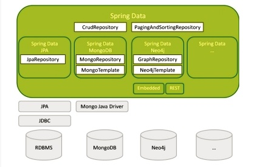

# Spring Data

* With every kind of persistence store, your repositories (a.k.a. DAOs, or Data Access Objects) 
  typically offer CRUD (Create-Read-Update-Delete ) operations on single domain objects, 
  finder methods, sorting and pagination. 
  
* Spring Data provides generic interfaces for these aspects 
  (CrudRepository, PagingAndSortingRepository) as well as persistence 
   store specific implementations.

                          
* With Spring Data’s repositories, you need only to write an interface 
  with finder methods defined according to a given set of conventions 
  (which may vary depending on the kind of persistence store you are using). 
  Spring Data will provide an appropriate implementation of that interface at runtime

    Example -
	
	public interface UserRepository extends MongoRepository<User, String> { 
	
			@Query("{ fullName: ?0 }")
			List<User> findByTheUsersFullName(String fullName);

			List<User> findByFullNameLike(String fullName, Sort sort);
	}

* Most Spring Data projects support the followings aspects :

	- Templating
	- Object/Datastore mapping
	- Repository support

	Other Spring Data projects like Spring Data Redis or Spring Data Riak 
	essentially provide only templates, because the corresponding datastores
	persist unstructured data that cannot be mapped or queried
	
## Templates

* The main purpose of a Spring Data template (and all other Spring templates) is : 
  - resource allocation
  - exception translation
   
* A template offers store specific operations like saving, updating and deleting 
  a single record or for executing queries or map/reduce jobs. 
  But all these methods work only for the corresponding underlying datastore.

* Spring Data JPA does not offer a template, since the JPA implementation
  itself is already an abstraction layer on top of the JDBC API.
  JPA’s EntityManager is the counterpart of a template.
  Exception translation is handled by the repository implementation.

## Object/Datastore Mapping

* JPA introduced a standard for O/R mapping (i.e. mapping object graphs to relational database tables).
   Hibernate is probably the most common O/R mapper that implements the JPA specification.

* With Spring Data, this support is extended to NoSQL datastores with object-like data structures.
  But these data structures can be quite different from each other, so it would be difficult 
  to make up a common API for object/datastore mapping.
  
* Each type of datastore comes with its own set of annotations to provide 
  the needed meta information for the mapping

  Let’s see how a simple domain object User may be mapped to our datastores:

    // JPA

	@Entity
	@Table(name="TUSR")
	public class User {

	  @Id
	  private String id;

	  @Column(name="fn")
	  private String name;

	  private Date lastLogin;

	...
	}

	// MongoDB
	
	@Document(
	collection="usr")
	public class User {

	  @Id
	  private String id;

	  @Field("fn")
	  private String name;

	  private Date lastLogin;

	 ...
	}

	// Neo4j
	
	@NodeEntity
	public class User {

	  @GraphId
	  Long id;

	  private String name;

	  private Date lastLogin;

	...
	}
	
* If you are familiar with JPA entities you will recognize the standard JPA annotations.
  Spring Data reuses them; no other annotations are introduced. 

  
   MongoDB and Neo4j use an object mappings that is similar to the 
   well known JPA O/R mapping, but it is not quite the same because of the 
   different data structures. 

## Repository Support

* If you have ever persisted data in your business application,
  you probably wrote some kind of DAO. Usually you implement the CRUD operations
  for single records and a bunch of finder methods for each persistent class

* Finder methods take parameters that are put into your query before you execute them.

* With the advent of JPA, at least the CRUD operations are available through 
  the EntityManager interface. Writing custom finders is still boring though: 
  create a named query, set each parameter, execute that query. For example:
  
  
	@Entity
	@NamedQuery( name="myQuery", query = "SELECT u FROM User u where u.name = :name" )
	public class User { 
	 ...
	} 
  
	@Repository 
	public class ClassicUserRepository { 

	   @PersistenceContext EntityManager em; 

	   public List<User> findByName(String Name) { 
		  TypedQuery<User> q = getEntityManger().createNamedQuery("myQuery", User.class); 

		  q.setParameter("name", fullName);

		  return q.getResultList();
	   } 
	   ..
	   
* This can be slightly reduced by using the fluent interface of a TypedQuery ..

	@Repository
	public class ClassicUserRepository { 

	   @PersistenceContext EntityManager em; 

	   public List<User> findByName(String name) {
		  return getEntityManger().createNamedQuery("myQuery", User.class)
			 .setParameter("name", fullName)
			 .getResultList(); 
	   } 
	   ...
	   
     ... but still you are implementing a method that calls setters and executes 
	 the query for each and every query
	 
* With Spring Data JPA the same query comes down to the following piece of code:	

	public interface UserRepository extends JpaRepository<User, String> {

	   List<User> findByName(String name); 
	}  

* With Spring Data JPA, JPQL queries don’t have to be declared as @NamedQuerys 
  in the class file of the corresponding JPA entity. 
  
  Instead a query is an annotation of the repository method(!):
	
	@Transactional(timeout = 2, propagation = Propagation.REQUIRED)
	@Query("SELECT u FROM User u WHERE u.name = 'User 3'")
	List<User> findByGivenQuery();
	
* All the above also holds true for Spring Data MongoDB and Spring Data Neo4j

* The main advantages of repository support are:
	- The developer writes a lot less boilerplate code
	- Queries can by defined alongside the finder method and its documentation
	- As a bonus, the JPQL queries are compiled as soon as the Spring context is assembled,
	  not the first time you use the query, which makes it easier to detect syntax errors

## Modules

* Currently the release train contains the following modules:

- Spring Data Commons
- Spring Data JPA
- Spring Data KeyValue
- Spring Data LDAP
- Spring Data MongoDB
- Spring Data Redis
- Spring Data for Apache Cassandra
- Spring Data for Apache Solr
- Spring Data Gemfire
- Spring Data for Apache Geode
- Spring Data REST
- Spring Data Couchbase (community module)
- Spring Data Elasticsearch (community module)
- Spring Data Neo4j (community module)

References
==========
https://www.infoq.com/articles/spring-data-intro   
http://projects.spring.io/spring-data/
